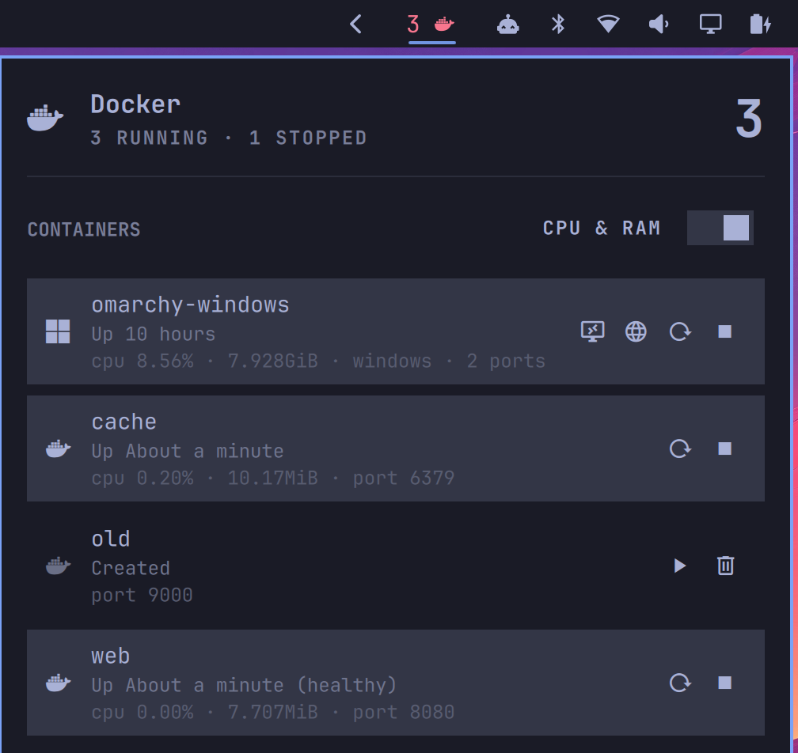
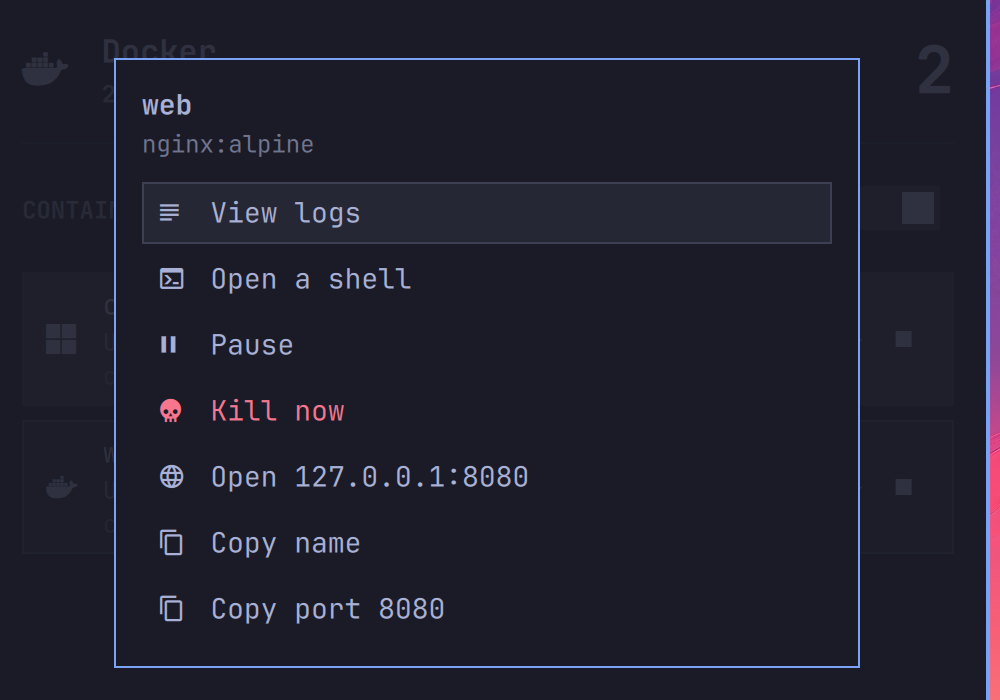

# Docker VMs

An Omarchy bar widget for Docker: start, restart, stop and remove containers,
and open a desktop session on a Windows (or macOS) VM built from the
[dockur](https://github.com/dockur/windows) images.



## Requirements

| Dependency | Needed for | Notes |
|---|---|---|
| `docker` CLI | everything | Your user must be able to run `docker` without `sudo` (usually via the `docker` group). |
| `omarchy-windows-vm` | the session button on the `omarchy-windows` container | Ships with Omarchy. |
| `xfreerdp3` | the session button on any other VM container | Package `freerdp`. Omarchy installs it with `omarchy-windows-vm install`. |
| `omarchy-launch-browser` or `xdg-open` | the web viewer button | One of the two is present on any desktop. |
| `uwsm` | detaching launched clients into their own scope | Optional; falls back to `setsid`. |

Everything else is stock Omarchy: the shell, `bash`, and the plugin's own
files. Nothing is downloaded at runtime.

## Install

```bash
omarchy plugin add https://github.com/dicemans/omarchy-plugin-docker-vms.git --enable
```

The widget lands in the bar's right section. Move it with:

```bash
omarchy bar move io.github.dicemans.docker-vms --section left
```

<details>
<summary>Manual install</summary>

```bash
git clone https://github.com/dicemans/omarchy-plugin-docker-vms.git \
  ~/.config/omarchy/plugins/io.github.dicemans.docker-vms
omarchy-shell shell rescanPlugins
omarchy plugin enable io.github.dicemans.docker-vms --section right
```
</details>

## Removal

```bash
omarchy plugin remove io.github.dicemans.docker-vms
```

That deletes the plugin directory and drops its entry from
`~/.config/omarchy/shell.json`. Nothing else is left behind: the plugin writes
no state of its own, and it never touches your containers on the way out.

## Row actions

| Icon | Action | Shown when |
|------|--------|------------|
| 󰢹 | Open desktop session (RDP) | the container is a VM image and has an RDP port published |
| 󰖟 | Open the web viewer in the browser | port 8006 is published |
| 󰑓 | Restart | the container is running |
| 󰓛 | Stop | the container is running |
| 󰐊 | Start | docker can start it — `created` or `exited` |
| 󰩺 | Remove container | docker will let it go — `created`, `exited` or `dead` |

The session button starts a stopped VM before connecting, so it is a single
click from "off" to "at the Windows desktop". For the container Omarchy
installs (`omarchy-windows`) it delegates to `omarchy-windows-vm launch -k`,
which already knows the compose file, the credentials, and the display
scaling — and `-k` means closing the RDP window leaves the VM running. Any
other VM container is connected to directly with `xfreerdp3`, using the
`USERNAME` / `PASSWORD` the container was created with.

**Clicking a row opens its menu.** Starting, stopping and restarting already
have their own buttons, so making the row a shortcut for one of them only
created a place where a stray click did something unexpected.

Under each name sits a second line: how the container is *behaving* — health,
CPU and memory when the monitor is on, compose project, restart count,
published ports. What it *is* — the image — lives in the menu header, where
there is room to read it without eliding.

## The menu



A click on the row, or `m` from the keyboard. Everything that does not earn a
permanent button lives here, and it is built from the container's state, so it
never offers something docker would refuse:

| Entry | Shown when |
|---|---|
| View logs | always — `docker logs -f --tail 200` in a terminal |
| Open a shell | any running container. On a VM it is labelled *(container)*, because it lands in the container running QEMU rather than inside the guest — which is exactly where you look when a VM will not boot |
| Pause / Resume | running / paused |
| Kill now | running or restarting |
| Open 127.0.0.1:*port* | one entry per published port, in the browser |
| Open folder *name* | one entry per bind mount |
| Copy name, Copy port | always |

## Performance monitor

Off by default. The switch sits next to the **CONTAINERS** heading, labelled
`CPU & RAM`, and `s` toggles it from the keyboard.

The reason it is opt-in is measurable: on the machine this was built on,
`docker stats --no-stream` costs a flat **~2000 ms** whether there are zero,
one or five containers — it waits for two samples a second apart to compute a
percentage — against **~60 ms** for the entire listing. The cost is a wait, not
CPU: the whole refresh loop is under 0.2% of an eight-core machine either way.
But a two-second wait inside the refresh would make the panel feel broken, so
when the monitor is on the numbers come from a second, slower timer in its own
process, and the list keeps its own pace.

## Removing a container always asks first

The trash button opens a confirmation dialog naming the container, and the
answer starts on *Cancel* so a stray Enter cannot delete. The confirmation is
not something a caller can skip: the IPC `remove` below puts the same question
on screen rather than deleting.

Removal is offered only where docker will actually allow it, and it runs a plain
`docker rm` — never `-f`, never `-v` — so the image and every volume survive,
including the bind mount that holds a VM's disk. Recreating the container over
the same volume gets the machine back.

## States

The panel follows docker's states rather than a running/stopped guess, because
the guess produced wrong offers: a **paused** container used to be handed *Start*
(which cannot resume it) and *Remove* (which docker refuses), and one stuck in a
**restart loop** was counted as stopped — the bar said "0 running" while a
container thrashed.

| State | Offered |
|---|---|
| `running`, `paused`, `restarting` | Restart, Stop |
| `created`, `exited` | Start, Remove |
| `dead` | Remove |
| `removing`, anything unrecognised | nothing |

A container failing its healthcheck, stuck restarting, or `dead` is painted in
the urgent colour, in the row and in the bar. The bar swaps the whale for an
alert glyph when the docker daemon cannot be reached, so a dead daemon no longer
looks like an idle one.

## Keyboard

Arrow keys (or `hjkl`) move between rows; left/right steps through a row's
action buttons, `Enter` activates, `x` asks to remove the selected container,
`r` refreshes now, `c` opens the desktop session and `v` the web viewer,
`m` (or `Enter` on the row) opens the menu, `s` toggles the performance
monitor, `Esc` closes,
`Tab` moves to the next bar panel. Every action the panel offers is reachable
without a mouse. While the confirmation is up
it owns the keys: left/right switch the answer, `Enter` takes it, `Esc`
cancels.

The first key press only reveals the cursor, so a panel summoned by keyboard
never acts on a row you have not looked at yet.

## Settings

Set these on the widget's entry in `~/.config/omarchy/shell.json`, or through
Setup > Plugins.

| Key | Default | Meaning |
|-----|---------|---------|
| `refreshIntervalSec` | `5` | Refresh cadence while the panel is open. Closed, it backs off to 30s. |
| `nameFilter` | `""` | Only list containers whose name contains this text. |
| `vmsOnly` | `false` | Hide plain containers and list only Windows/macOS VMs. |
| `stopTimeoutSec` | `60` | Seconds docker may spend on a clean shutdown before killing the container. Docker's own default without this is 10 seconds — a power cut for a virtual machine. |
| `rdpTimeoutSec` | `120` | Seconds to wait for a cold VM to answer on RDP before giving up. |
| `showStats` | `false` | Show CPU and memory. See the note above on why this is opt-in. |
| `statsIntervalSec` | `15` | How often CPU and memory are sampled while the monitor is on. |
| `showCount` | `true` | Paint the number of active containers next to the bar glyph. |

## IPC

Every action is scriptable, which is what makes it bindable to a key:

```bash
omarchy-shell io.github.dicemans.docker-vms toggle
omarchy-shell io.github.dicemans.docker-vms rdp omarchy-windows
omarchy-shell io.github.dicemans.docker-vms viewer omarchy-windows
omarchy-shell io.github.dicemans.docker-vms start|stop|restart <container>
omarchy-shell io.github.dicemans.docker-vms remove <container>   # asks, never deletes outright
```

When an action fails, the panel shows **docker's own first line** — "port is
already allocated", "cannot start a paused container, try unpause instead" —
rather than a generic "could not start the container".

The action calls answer `ok` or `busy` (another action is still in flight) —
never a silent success. `remove` answers `confirm` once the question is on
screen, or `container is running` when it refuses outright. A name that does
not exist is reported by the helper and shown in the panel.

For example, in `~/.config/hypr/bindings.lua`:

```lua
o.bind("SUPER SHIFT", "W", "Windows VM", "omarchy-shell io.github.dicemans.docker-vms rdp omarchy-windows")
```

## Privileges and security

Omarchy plugins run **unsandboxed inside the long-running `omarchy-shell`
process**, with your user's permissions. What this one does with them:

- **No `sudo`, no `pkexec`, no polkit.** Every docker call is the plain
  `docker` CLI run as you. If your user cannot talk to the docker socket, the
  panel says so and does nothing.
- Note that membership in the `docker` group is effectively root on the host —
  that is a property of docker itself, not of this plugin, but it is the
  privilege boundary this widget sits on.
- **No second Quickshell process.** The widget lives in the shell that is
  already running.
- **It writes nothing outside its own directory** and changes no user
  configuration. Adding the widget to your bar is done by
  `omarchy plugin enable`, at your request.
- **Nothing is fetched at runtime** — no network calls, no downloads, no
  telemetry. The only outbound connection is the RDP client you asked for,
  to `127.0.0.1`.
- **The RDP password never reaches the argument vector.** `/proc/<pid>/cmdline`
  is world-readable, so a credential passed as `/p:secret` is handed to every
  other user on the machine. The plugin instead invokes
  `xfreerdp3 /args-from:stdin` and writes the whole argument list — the
  password included — down a pipe, so the process list shows only the flag.
  The secret is unset as soon as the pipe owns it. This is also why the client
  is detached with `setsid` rather than `uwsm` on that path: `uwsm` hands the
  launch to a daemon, and the pipe would not reach the process that must read
  it. For `omarchy-windows` the plugin delegates to `omarchy-windows-vm` and
  never handles the password at all.
- **Every read from docker is bounded while it is read.** A host with thousands
  of containers, or a container with a megabyte-long name, cannot grow the
  long-running shell process: each `docker` invocation is capped at 256 KiB and
  200 rows by a consumer-side `head` (the producer is stopped by SIGPIPE), each
  field is clipped to 512 characters, and diagnostics to 400. The same caps are
  applied again in `Model.js` before anything reaches the panel. When the row
  cap is hit the list still works and the panel says so in a footnote.
- **Deletion is narrow by construction**: stopped containers only, plain
  `docker rm`, behind a confirmation dialog.

## Layout

```
manifest.json          plugin manifest (bar-widget, entry point, settings schema)
Panel.qml              bar button + panel
Model.js               parsing and per-row action rules, no QML types
bin/docker-vm-ctl      every docker call, port lookup, and client launch
preview.png            the panel screenshot
menu.png               the menu screenshot
LICENSE                MIT
```

`bin/docker-vm-ctl` is a plain script and is the place to look when something
misbehaves — run it in a terminal:

```bash
~/.config/omarchy/plugins/io.github.dicemans.docker-vms/bin/docker-vm-ctl list
```

Its `remove` refuses a running container regardless of what the panel
believes, so the guard holds even if the list on screen is a few seconds
stale.

`list` prints one TSV line per container: name, image, state, status, kind,
RDP port, web port. Ports are read from `HostConfig.PortBindings`, which
survives a stop — `docker ps` reports no ports at all for a stopped container,
which would otherwise hide the connect button on exactly the VMs you want to
start.

## License

MIT — see [LICENSE](LICENSE).
